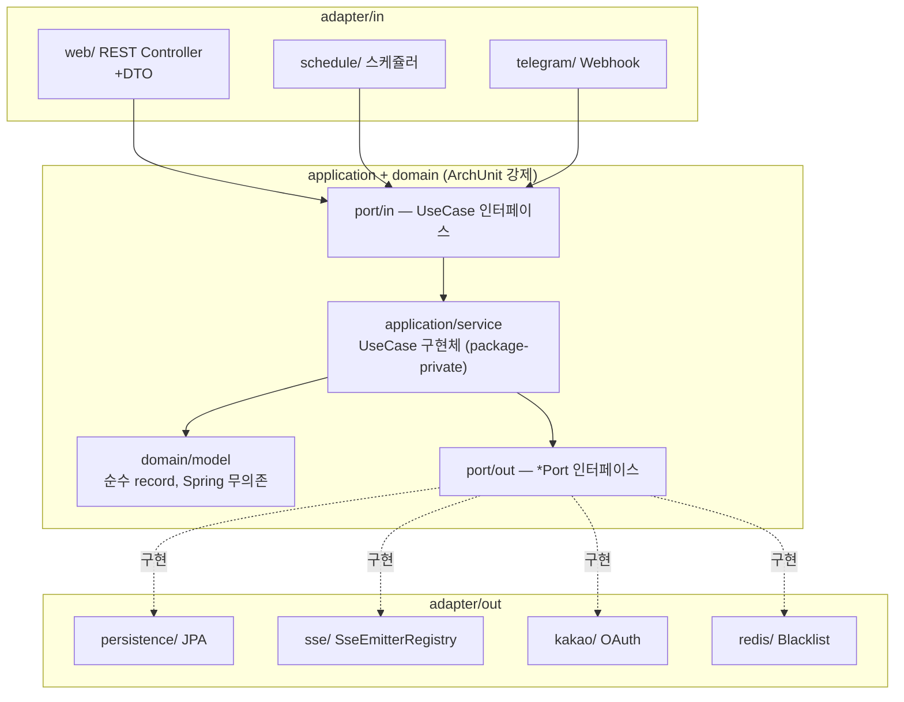
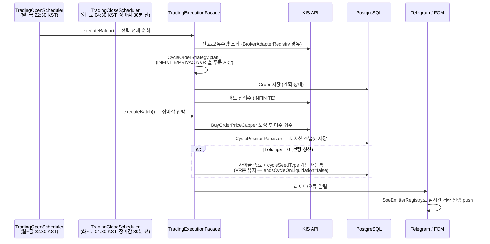
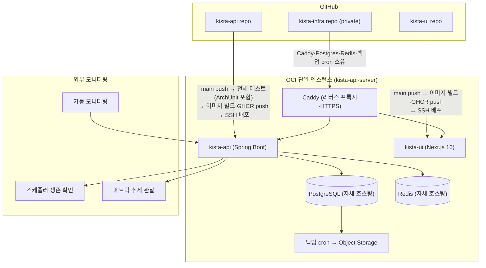

# kista-api

KISTA(Key Investment Strategy & Trading Automation) — 정밀한 투자 전략을 기반으로 작동하는 다중 증권사 통합 자동매매 SaaS의 백엔드.
프론트엔드는 별도 저장소 [`kista-ui`](https://github.com/narafu/kista-ui)(Next.js 16)와 연동하며, 같은 OCI 인스턴스에서 함께 호스팅된다.

## 기술 스택

Java 21 · Spring Boot 4 · Hexagonal Architecture · Spring Modulith(점진 도입) · PostgreSQL · Redis · Flyway · OCI

## 아키텍처

### 계층 구조 (Hexagonal Architecture)

레이어 의존 방향(`adapter → application → domain`)은 ArchUnit(`HexagonalArchitectureTest`)이 빌드 시 강제 검증한다. 아래 다이어그램은 아직 레거시 최상위 구조(`com.kista.{domain,application,adapter}`)에 남은 애그리게이트 기준이다 — 가계부(`finance`)·알림(`notify`)·증권사 연동(`broker`)·매매 코어(`trading`)·시장 참조 데이터(`market`)·FIDA 기준 매매표(`privacy`)는 Spring Modulith 이전 모듈로 각각 별도 최상위 패키지(`com.kista.finance`/`notify`/`broker`/`trading`/`market`/`privacy`)에서 동일한 레이어 구조를 유지하며 `ApplicationModules.verify()`로 모듈 경계까지 추가 검증받는다 (상세 → `docs/agents/architecture.md` "Spring Modulith 점진 도입").

### 트레이딩 스케쥴러 흐름

## 배포

- `kista-infra`(private) 레포가 Caddy(양 도메인 리버스 프록시)·자체 호스팅 PostgreSQL·Redis·백업 cron을 전담하며, kista-api·kista-ui와 같은 OCI 인스턴스에서 Docker Compose로 운영된다(2026-08-07 인스턴스 재편·DB 이관 완료 — 기존 Fly.io·Vercel·Supabase는 폐지).
- 백업 메커니즘·주기 상세는 `docs/agents/docker-infra.md` 참고.
- 외부 모니터링은 서로 다른 실패 모드를 감지한다: 가동 모니터링(서버 다운) / 생존 확인(스케쥴러 정지) / 메트릭 추세(리소스 악화).
