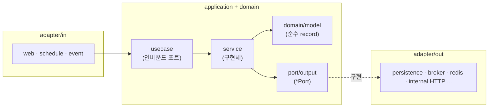
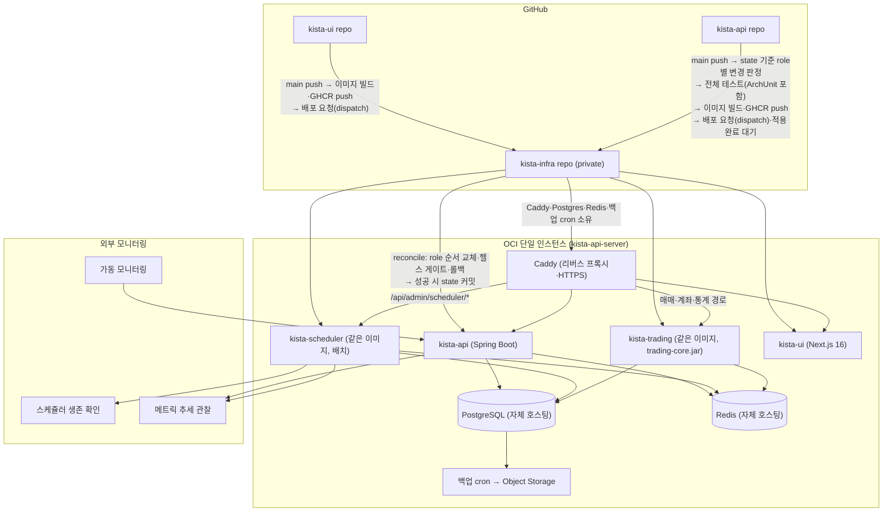

# kista-api

[](https://github.com/narafu/kista-api/actions/workflows/ci.yml)


KISTA(Key Investment Strategy & Trading Automation) — 한국투자증권(KIS)·토스증권 API 기반 해외주식 자동 분할매매 SaaS의 백엔드.
프론트엔드는 별도 저장소 [`kista-ui`](https://github.com/narafu/kista-ui)(Next.js 16)이며, 같은 OCI 인스턴스에서 함께 호스팅된다.

## 주요 기능

- **매매 전략**: INFINITE(무한매수) · PRIVACY(FIDA 기준 매매표) · VR(밸류 리밸런싱)
- **증권사**: KIS · 토스증권 · MOCK(모의 계좌)
- **매매 배치**: 개장(월~금 22:30 KST) · 마감(화~토 04:30 KST) 스케쥴러가 활성 전략을 일괄 실행
- **알림**: 사용자 텔레그램 봇 · FCM 푸시 · SSE 실시간 거래 알림
- **부가 기능**: 계좌·전략 통계, 백테스트, 가계부, 주택/ETF 벤치마크 비교, 공포탐욕지수, 관리자 콘솔

## 기술 스택

Java 21 · Spring Boot 4 · Hexagonal Architecture · Spring Modulith · PostgreSQL 17 · Redis · Flyway · Docker Compose · OCI

## 구조

Gradle 서브프로젝트 3개, 배포 프로세스 3개.

| 서브프로젝트 | 산출물 | 프로세스 | 담당 |
|---|---|---|---|
| `:api` (루트) | `app.jar` | `kista-api` · `kista-scheduler` | 인증·사용자·관리자·가계부·알림·시장 데이터·벤치마크 |
| `:trading-core` | `trading-core.jar` | `kista-trading` | 매매 실행·주문 계산·증권사 연동·계좌·통계·매매 알림 |
| `:shared` | (라이브러리) | — | 공용 어휘(sharedkernel)·내부 API wire 계약(contract)·인프라(platform) |

- `:api`와 `:trading-core`는 서로의 main 코드를 참조하지 않는다 — 내부 HTTP API·Redis로만 통신하고, wire 타입은 `:shared`의 `com.kista.contract`를 공유한다.
- 각 모듈 내부는 Hexagonal(`adapter → application → domain`) 구조다. 레이어 방향은 `HexagonalArchitectureTest`, 모듈 경계는 `ModulithArchitectureTest`(`ApplicationModules.verify()`), Gradle 방향은 `GradleModuleBoundaryTest`가 빌드 시 강제한다.


```mermaid
graph LR
    subgraph in["adapter/in"]
        web["web · schedule · event"]
    end
    subgraph core["application + domain"]
        usecase["usecase<br/>(인바운드 포트)"]
        service["service<br/>(구현체)"]
        domain["domain/model<br/>(순수 record)"]
        portout["port/output<br/>(*Port)"]
    end
    subgraph out["adapter/out"]
        adapters["persistence · broker · redis · internal HTTP ..."]
    end
    web --> usecase --> service
    service --> domain
    service --> portout
    portout -. 구현 .-> adapters
```

시스템 컨텍스트·스키마 경계·프로세스 간 통신·매매 배치 시퀀스 그림은 [`docs/architecture-map.md`](docs/architecture-map.md) 참고.

## 로컬 실행

```bash
docker compose up -d postgres redis                          # DB·Redis
./gradlew :bootRun --args='--spring.profiles.active=local'  # root (8080)
./gradlew test                                               # 전체 테스트 (postgres 필요)
```

- 로컬 설정은 `src/main/resources/application-local.yml`(gitignored) — 필수 환경변수·키 목록은 [`CLAUDE.md`](CLAUDE.md) "환경 설정"
- root + trading-core 2-프로세스 동시 기동, dev 토큰 발급, 시드 데이터 → [`docs/agents/commands.md`](docs/agents/commands.md)

## 배포


```mermaid
graph TB
    subgraph GH["GitHub"]
        RepoUI["kista-ui repo"]
        RepoAPI["kista-api repo"]
        RepoInfra["kista-infra repo (private)"]
    end

    subgraph OciInfra["OCI 단일 인스턴스 (kista-api-server)"]
        Caddy["Caddy (리버스 프록시·HTTPS)"]
        APIApp["kista-api (Spring Boot)"]
        SchedApp["kista-scheduler (같은 이미지, 배치)"]
        TradingApp["kista-trading (같은 이미지, trading-core.jar)"]
        UIApp["kista-ui (Next.js 16)"]
        PG[("PostgreSQL (자체 호스팅)")]
        Redis[("Redis (자체 호스팅)")]
        Backup["백업 cron → Object Storage"]
    end

    subgraph Monitoring["외부 모니터링"]
        Uptime["가동 모니터링"]
        HC["스케쥴러 생존 확인"]
        Grafana["메트릭 추세 관찰"]
    end

    RepoUI -->|"main push → 이미지 빌드·GHCR push<br/>→ 배포 요청(dispatch)"| RepoInfra
    RepoAPI -->|"main push → state 기준 role별 변경 판정<br/>→ 전체 테스트(ArchUnit 포함)<br/>→ 이미지 빌드·GHCR push<br/>→ 배포 요청(dispatch)·적용 완료 대기"| RepoInfra
    RepoInfra -->|"reconcile: role 순서 교체·헬스 게이트·롤백<br/>→ 성공 시 state 커밋"| APIApp
    RepoInfra --> SchedApp
    RepoInfra --> TradingApp
    RepoInfra --> UIApp
    RepoInfra -->|"Caddy·Postgres·Redis·백업 cron 소유"| Caddy
    Caddy --> APIApp
    Caddy -->|"/api/admin/scheduler/*"| SchedApp
    Caddy -->|"매매·계좌·통계 경로"| TradingApp
    Caddy --> UIApp
    APIApp --> PG
    SchedApp --> PG
    TradingApp --> PG
    APIApp --> Redis
    SchedApp --> Redis
    TradingApp --> Redis
    PG --> Backup
    Uptime --> APIApp
    SchedApp --> HC
    APIApp --> Grafana
    SchedApp --> Grafana
```

- 세 앱 프로세스는 **같은 GHCR 이미지**(arm64)를 쓴다 — api/scheduler는 `app.jar`를 `SCHEDULER_ENABLED`로 갈라 쓰고, trading은 `APP_JAR=trading-core.jar`.
- `kista-infra`(private)가 Caddy·PostgreSQL·Redis·백업 cron을 소유하고, 앱별 선언(`state/<app>.yml`)대로 서버에 reconcile한다. API 도메인 라우팅 규칙만은 이 레포 `deploy/server/caddy/kista-api.caddy`가 소유하며 `CaddyRoutingTest`가 컨트롤러 경로와 대조한다.
- 매매 시간대 배포 가드는 없다 — `kista-trading`은 재기동 시 진행 중 매매 배치를 재개한다. API 장애는 매매 배치에 영향을 주지 않는다.
- 외부 모니터링은 실패 모드별로 나뉜다: 가동(서버 다운) / 생존 확인(스케쥴러 정지) / 메트릭 추세(리소스 악화).

## 문서

| 문서 | 내용 |
|---|---|
| [`docs/architecture-map.md`](docs/architecture-map.md) | 줌 레벨별 구조 그림 |
| [`docs/agents/architecture.md`](docs/agents/architecture.md) | 모듈 목록·DB 스키마 소유 (SSOT) |
| [`docs/agents/workflow.md`](docs/agents/workflow.md) | 매매 스케쥴러·주문 흐름 |
| [`docs/agents/scheduler-time-table.md`](docs/agents/scheduler-time-table.md) | 배치 실행 시각 |
| [`docs/agents/constraints.md`](docs/agents/constraints.md) | 설계 제약·Flyway·Git 규칙 |
| [`docs/agents/docker-infra.md`](docs/agents/docker-infra.md) | 배포·운영 런북 |
| [`docs/agents/kis-api.md`](docs/agents/kis-api.md) · [`toss-api.md`](docs/agents/toss-api.md) | 증권사 API 연동 |
