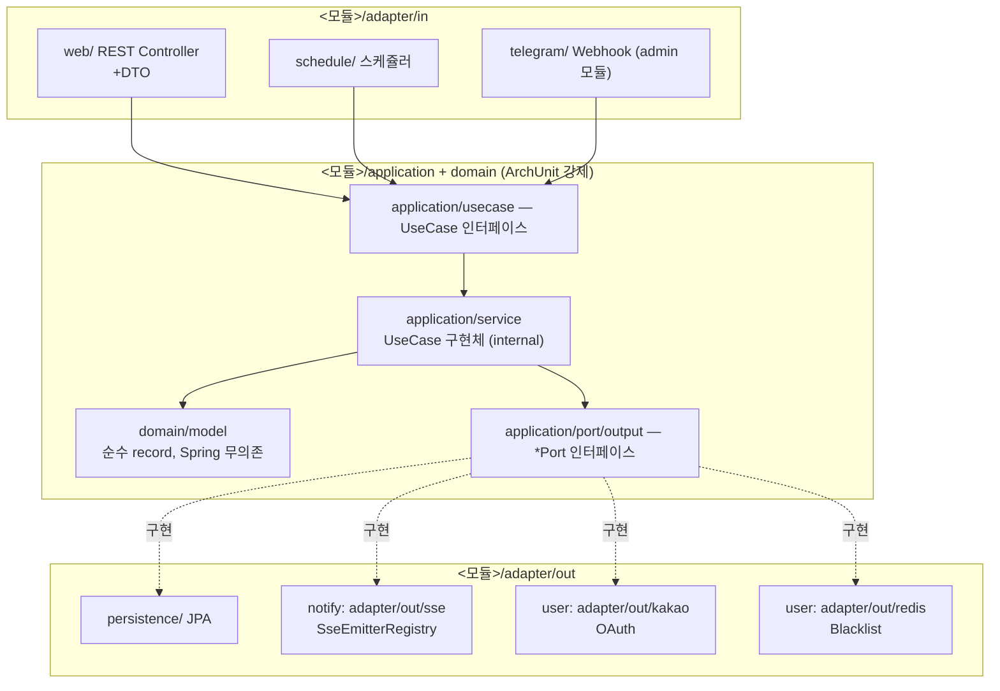
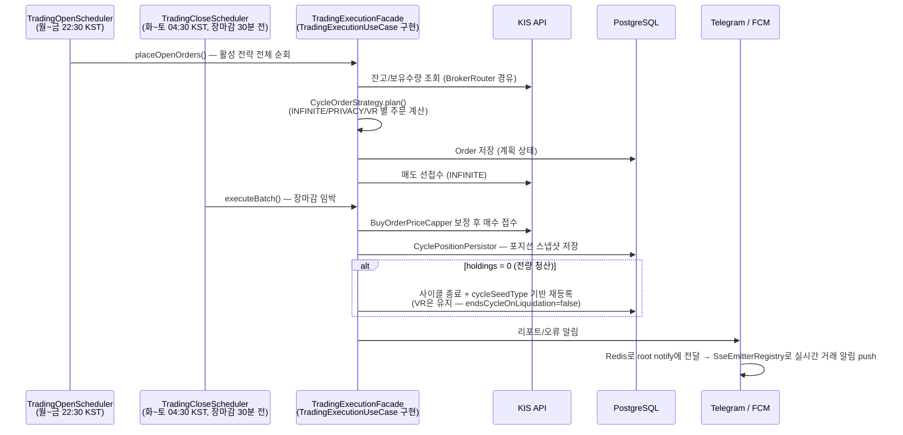
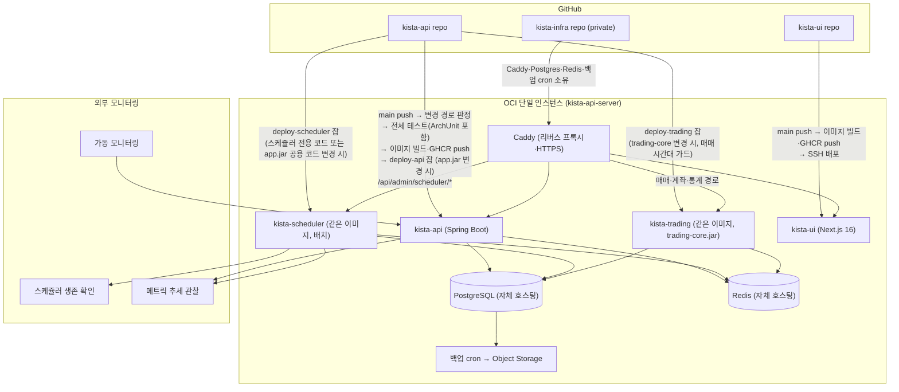

# kista-api

KISTA(Key Investment Strategy & Trading Automation) — 정밀한 투자 전략을 기반으로 작동하는 다중 증권사 통합 자동매매 SaaS의 백엔드.
프론트엔드는 별도 저장소 [`kista-ui`](https://github.com/narafu/kista-ui)(Next.js 16)와 연동하며, 같은 OCI 인스턴스에서 함께 호스팅된다.

## 기술 스택

Java 21 · Spring Boot 4 · Hexagonal Architecture · Spring Modulith · PostgreSQL · Redis · Flyway · OCI

## 아키텍처

### Gradle 멀티프로젝트

`:trading-core`(매매 실행 도메인 — trading/tradingstats/tradingnotify/matching/broker/account/privacy/marketcalendar, `trading-core.jar` 산출), `:shared`(sharedkernel/contract/platform — 공용 어휘·내부 API wire 계약·인프라 leaf), 루트 `:api`(그 외 전부, `app.jar` 산출) 세 서브프로젝트로 나눈다. `:trading-core`와 `:api`는 둘 다 `:shared`만 의존하고 서로의 main 코드는 참조하지 않으며(HTTP 내부 API·Redis로만 통신), 배포도 `kista-trading`(trading-core.jar) 프로세스가 별도로 뜬다(상세 → `docs/agents/architecture.md` "Gradle 구조").

### 계층 구조 (Hexagonal Architecture)

레이어 의존 방향(`adapter → application → domain`)은 ArchUnit(`HexagonalArchitectureTest`)이 빌드 시 강제 검증한다. 아래 다이어그램은 레이어 관계를 보여주는 일반 도해다. 애그리게이트는 전부 Spring Modulith 모듈이며(현재 모듈 목록 → `docs/agents/architecture.md` "모듈 한눈에 보기"), 크로스모듈 컨트롤러·전역 예외 핸들러는 앱셸 `com.kista.web`(trading-core 쪽 대칭 앱셸은 `com.kista.tradingweb`), persistence base·암호화·스케쥴러 골격은 `com.kista.platform`·`com.kista.sharedkernel`에 있고, 프로세스 경계(root↔trading-core)를 넘는 내부 API·Redis 요청/응답 타입은 `com.kista.contract`를 양쪽이 컴파일 타임에 공유한다. `ApplicationModules.verify()`가 모듈 경계까지 검증한다 (상세 → `docs/agents/architecture.md` "Spring Modulith 모듈 구성", 이관 경위는 `docs/agents/modulith-migration-history.md`).

각 모듈(예: `trading`/`user`/`notify`) 내부는 동일한 레이어 구조를 반복한다:

```mermaid
graph TB
    subgraph in["<모듈>/adapter/in"]
        web["web/ REST Controller\n+DTO"]
        schedule["schedule/ 스케쥴러"]
        telegram_in["telegram/ Webhook (admin 모듈)"]
    end

    subgraph core["<모듈>/application + domain (ArchUnit 강제)"]
        usecase["application/usecase — UseCase 인터페이스"]
        service["application/service\nUseCase 구현체 (internal)"]
        domain["domain/model\n순수 record, Spring 무의존"]
        portout["application/port/output — *Port 인터페이스"]
    end

    subgraph out["<모듈>/adapter/out"]
        persistence["persistence/ JPA"]
        sse["notify: adapter/out/sse\nSseEmitterRegistry"]
        kakao_out["user: adapter/out/kakao\nOAuth"]
        redis_out["user: adapter/out/redis\nBlacklist"]
    end

    web --> usecase
    schedule --> usecase
    telegram_in --> usecase
    usecase --> service
    service --> domain
    service --> portout
    portout -.구현.-> persistence
    portout -.구현.-> sse
    portout -.구현.-> kakao_out
    portout -.구현.-> redis_out
```

### 트레이딩 스케쥴러 흐름

```mermaid
sequenceDiagram
    participant S1 as TradingOpenScheduler<br/>(월~금 22:30 KST)
    participant S2 as TradingCloseScheduler<br/>(화~토 04:30 KST, 장마감 30분 전)
    participant TF as TradingExecutionFacade<br/>(TradingExecutionUseCase 구현)
    participant KIS as KIS API
    participant DB as PostgreSQL
    participant Noti as Telegram / FCM

    S1->>TF: placeOpenOrders() — 활성 전략 전체 순회
    TF->>KIS: 잔고/보유수량 조회 (BrokerRouter 경유)
    TF->>TF: CycleOrderStrategy.plan()<br/>(INFINITE/PRIVACY/VR 별 주문 계산)
    TF->>DB: Order 저장 (계획 상태)
    TF->>KIS: 매도 선접수 (INFINITE)

    S2->>TF: executeBatch() — 장마감 임박
    TF->>KIS: BuyOrderPriceCapper 보정 후 매수 접수
    TF->>DB: CyclePositionPersistor — 포지션 스냅샷 저장
    alt holdings = 0 (전량 청산)
        TF->>DB: 사이클 종료 + cycleSeedType 기반 재등록<br/>(VR은 유지 — endsCycleOnLiquidation=false)
    end
    TF->>Noti: 리포트/오류 알림
    Noti->>Noti: Redis로 root notify에 전달 → SseEmitterRegistry로 실시간 거래 알림 push
```

## 배포

```mermaid
graph TB
    subgraph GH["GitHub"]
        RepoUI["kista-ui repo"]
        RepoAPI["kista-api repo"]
        RepoInfra["kista-infra repo (private)"]
    end

    subgraph OciInfra["OCI 단일 인스턴스 (kista-api-server)"]
        Caddy["Caddy (리버스 프록시·HTTPS)"]
        APIApp["kista-api (Spring Boot)"]
        SchedApp["kista-scheduler (같은 이미지, 배치)"]
        TradingApp["kista-trading (같은 이미지, trading-core.jar)"]
        UIApp["kista-ui (Next.js 16)"]
        PG[("PostgreSQL (자체 호스팅)")]
        Redis[("Redis (자체 호스팅)")]
        Backup["백업 cron → Object Storage"]
    end

    subgraph Monitoring["외부 모니터링"]
        Uptime["가동 모니터링"]
        HC["스케쥴러 생존 확인"]
        Grafana["메트릭 추세 관찰"]
    end

    RepoUI -->|"main push → 이미지 빌드·GHCR push<br/>→ SSH 배포"| UIApp
    RepoAPI -->|"main push → 변경 경로 판정<br/>→ 전체 테스트(ArchUnit 포함)<br/>→ 이미지 빌드·GHCR push<br/>→ deploy-api 잡 (app.jar 변경 시)"| APIApp
    RepoAPI -->|"deploy-scheduler 잡<br/>(스케쥴러 전용 코드 또는 app.jar 공용 코드 변경 시)"| SchedApp
    RepoAPI -->|"deploy-trading 잡<br/>(trading-core 변경 시, 매매 시간대 가드)"| TradingApp
    RepoInfra -->|"Caddy·Postgres·Redis·백업 cron 소유"| Caddy
    Caddy --> APIApp
    Caddy -->|"/api/admin/scheduler/*"| SchedApp
    Caddy -->|"매매·계좌·통계 경로"| TradingApp
    Caddy --> UIApp
    APIApp --> PG
    SchedApp --> PG
    TradingApp --> PG
    APIApp --> Redis
    SchedApp --> Redis
    TradingApp --> Redis
    PG --> Backup
    Uptime --> APIApp
    SchedApp --> HC
    APIApp --> Grafana
    SchedApp --> Grafana
```

- `kista-infra`(private) 레포가 Caddy(양 도메인 리버스 프록시 — API 도메인 라우팅 규칙만은 이 레포 `deploy/server/caddy/kista-api.caddy`가 소유하고 `CaddyRoutingTest`로 컨트롤러 경로와 대조)·자체 호스팅 PostgreSQL·Redis·백업 cron을 전담하며, kista-api·kista-ui와 같은 OCI 인스턴스에서 Docker Compose로 운영된다.
- `kista-api`·`kista-scheduler`·`kista-trading`은 **같은 GHCR 이미지**(arm64 네이티브 러너에서 빌드)를 띄운다 — api/scheduler는 `app.jar`를 `SCHEDULER_ENABLED`로 갈라 쓰고, trading은 `APP_JAR=trading-core.jar`를 쓴다. 매매 시간대 배포 가드는 `deploy-trading` 잡에만 있고 API·스케쥴러 배포는 시간대 제약이 없다. API 크래시·OOM·요청경로 버그가 매매 배치를 건드리지 않는다 (상세 → `docs/agents/docker-infra.md`).
- 백업 메커니즘·주기 상세는 `docs/agents/docker-infra.md` 참고.
- 외부 모니터링은 서로 다른 실패 모드를 감지한다: 가동 모니터링(서버 다운) / 생존 확인(스케쥴러 정지) / 메트릭 추세(리소스 악화).
