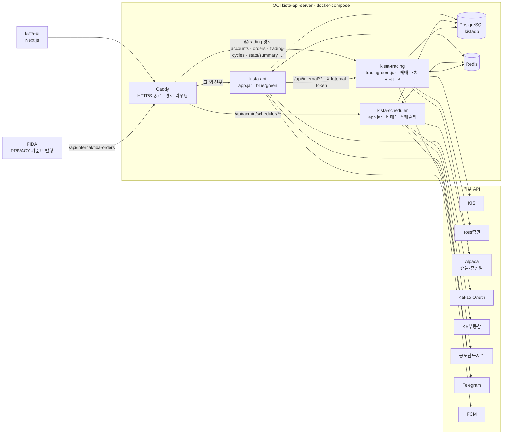
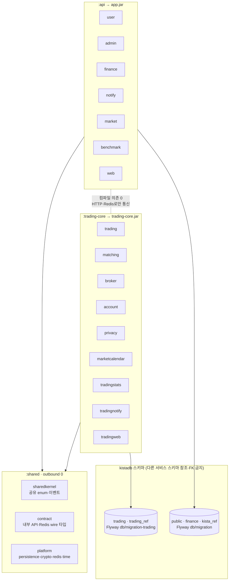
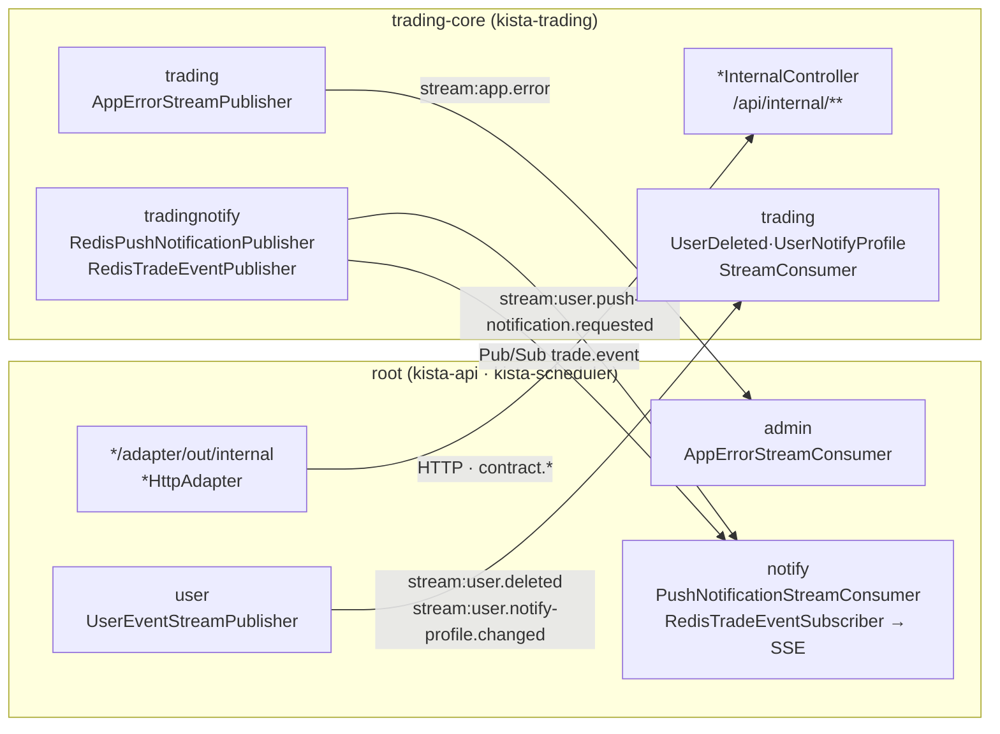
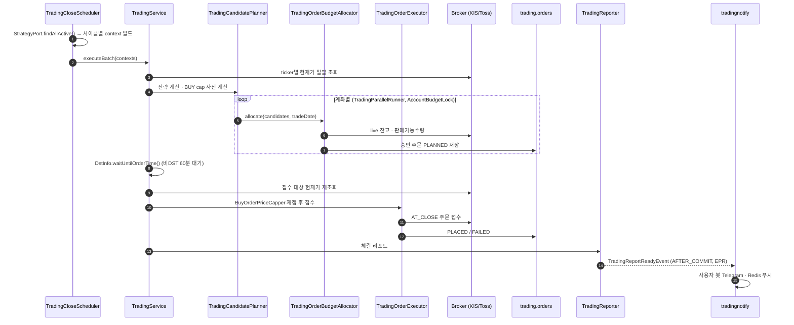

# 아키텍처 맵

전체 구조를 줌 레벨별로 보여주는 그림 모음이다. 텍스트 규칙·모듈 목록의 SSOT는 `docs/agents/architecture.md`이고, 이 문서는 그림과 링크만 둔다 — 서술이 필요하면 그쪽을 고친다.

| 레벨 | 질문 | 위치 |
|---|---|---|
| L0 시스템 컨텍스트 | 어떤 프로세스와 외부 시스템이 있나 | 아래 L0 |
| L1 빌드·스키마 경계 | 어느 모듈이 어느 jar·DB 스키마 소속인가 | 아래 L1 |
| L1.5 프로세스 간 통신 | root ↔ trading-core는 무엇으로 대화하나 | 아래 L1.5 |
| L2 모듈 의존 그래프 | 모듈끼리 누가 누구를 참조하나 | **자동 생성** — 아래 L2 |
| L3 핵심 흐름 | 매매 배치는 어떤 순서로 도나 | 아래 L3, 상세는 `docs/agents/workflow.md` |

## L0 시스템 컨텍스트



- 라우팅 SSOT: `deploy/server/caddy/kista-api.caddy` (`CaddyRoutingTest`가 컨트롤러 경로와 대조)
- 배포·role 상세: `docs/agents/docker-infra.md` "서버 배포 방식"

## L1 빌드·스키마 경계



- 경계 검증: `GradleModuleBoundaryTest`(Gradle 방향), `InternalApiContractTest`(wire 타입), `ModulithArchitectureTest`(모듈), `HexagonalArchitectureTest`(레이어)

## L1.5 프로세스 간 통신

root → trading-core는 내부 HTTP와 Redis Stream, trading-core → root는 Redis만 쓴다(trading-core는 root HTTP를 호출하지 않는다).



- Stream 공통 규약: `platform.redis.RedisStreams`, 키·그룹명: `RedisStreamConfig`
- JWT 블랙리스트도 Redis 공유(root `RedisBlacklistAdapter` 기록 → trading-core `RedisTokenBlacklistReader` 조회)

## L2 모듈 의존 그래프 (자동 생성)

손으로 그리지 않는다. `ModulithArchitectureTest`가 `Documenter`로 실제 의존 기준 PlantUML을 생성한다.

```bash
./gradlew :test --tests 'com.kista.architecture.ModulithArchitectureTest'
# 출력: build/spring-modulith-docs/components.puml (전체), module-<name>.puml (모듈별)
```

IntelliJ PlantUML Integration 플러그인으로 `.puml`을 열면 렌더링된다.

## L3 마감 매매 배치 (화~토 04:30 KST)

개장 배치(`TradingOpenScheduler`, 월~금 22:30 KST)도 같은 골격이다. 단계·예외 처리 상세는 `docs/agents/workflow.md`.


