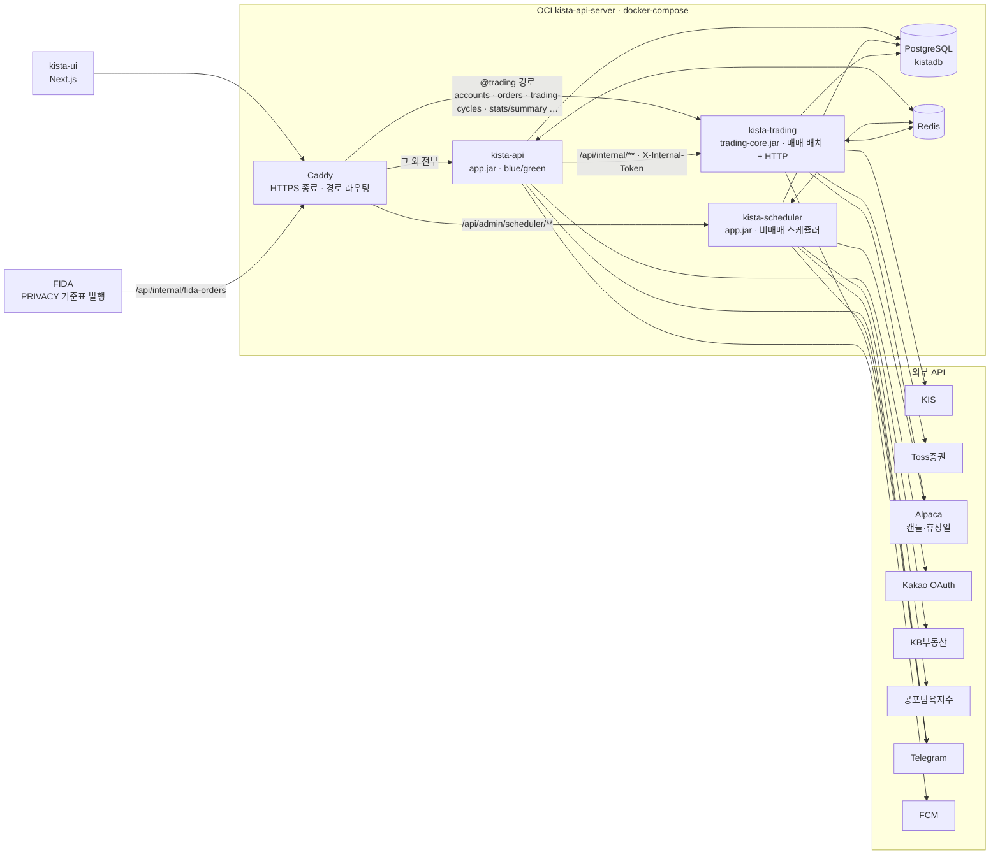
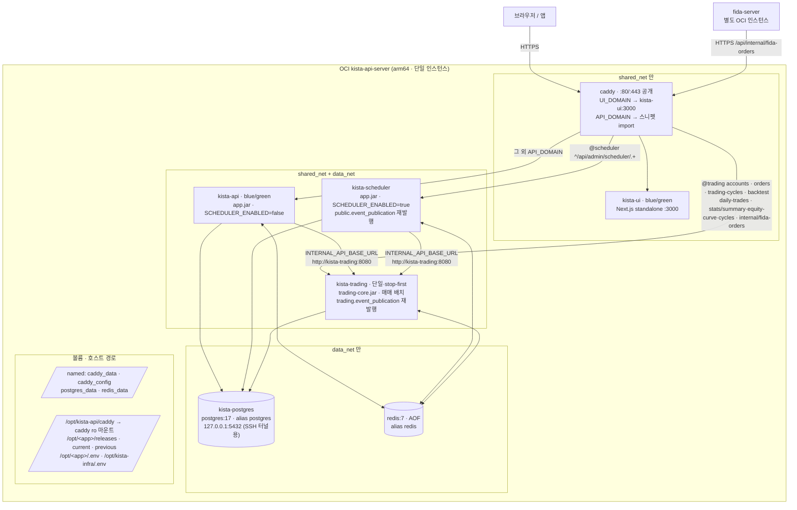
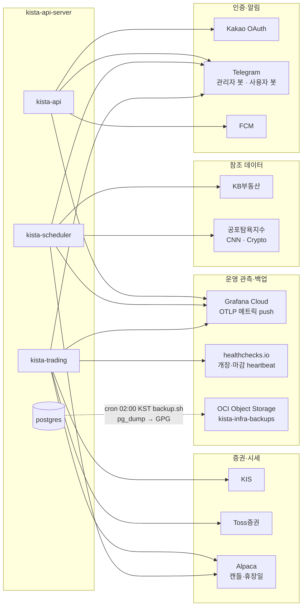
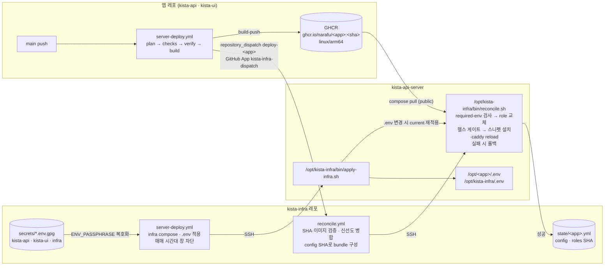
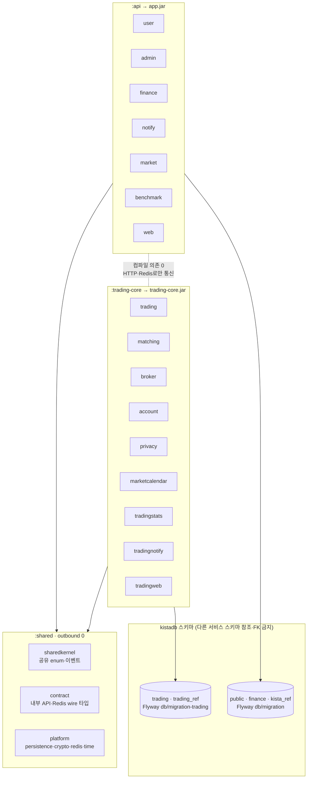
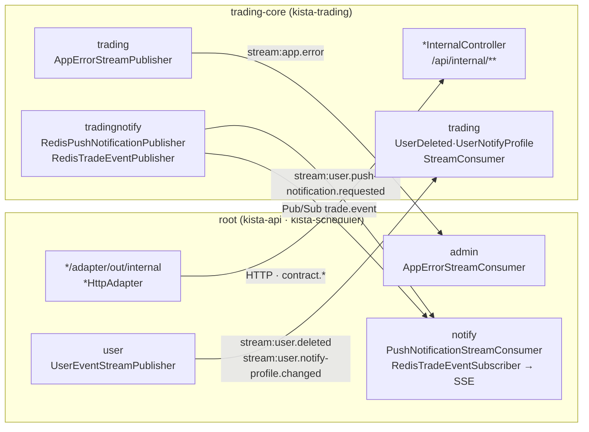
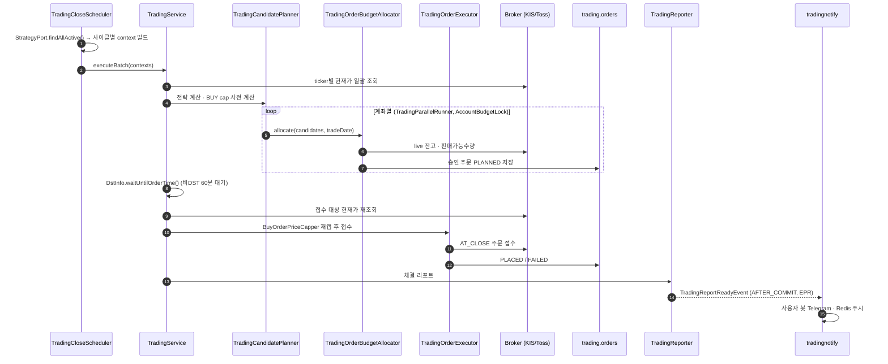

# 아키텍처 맵

전체 구조를 줌 레벨별로 보여주는 그림 모음이다. 텍스트 규칙·모듈 목록의 SSOT는 `docs/agents/architecture.md`이고, 이 문서는 그림과 링크만 둔다 — 서술이 필요하면 그쪽을 고친다.

| 레벨 | 질문 | 위치 |
|---|---|---|
| L0 시스템 컨텍스트 | 어떤 프로세스와 외부 시스템이 있나 | 아래 L0 |
| L0-1 배포 구성 | 어떤 컨테이너·네트워크·볼륨에 어떻게 배포되나 | 아래 L0-1 |
| L1 빌드·스키마 경계 | 어느 모듈이 어느 jar·DB 스키마 소속인가 | 아래 L1 |
| L1.5 프로세스 간 통신 | root ↔ trading-core는 무엇으로 대화하나 | 아래 L1.5 |
| L2 모듈 의존 그래프 | 모듈끼리 누가 누구를 참조하나 | **자동 생성** — 아래 L2 |
| L3 핵심 흐름 | 매매 배치는 어떤 순서로 도나 | 아래 L3, 상세는 `docs/agents/workflow.md` |
| 업무 흐름 맵 | 무엇이 계기가 되어 어떤 순서로 어디까지 가나·하루에 언제 무엇이 도나 | **반자동 생성** — 아래 "업무 흐름 맵" |

## L0 시스템 컨텍스트



- 라우팅 SSOT: `deploy/server/caddy/kista-api.caddy` (`CaddyRoutingTest`가 컨트롤러 경로와 대조)
- 배포·role 상세: `docs/agents/docker-infra.md` "서버 배포 방식"

## L0-1 배포 구성

L0을 컨테이너·네트워크·볼륨·배포 경로 수준으로 펼친 그림이다. 소유 레포가 셋으로 갈린다 — `kista-infra`(caddy·postgres·redis·네트워크·시크릿·reconcile), `kista-api`(앱 3 role compose + API 도메인 라우팅 스니펫), `kista-ui`(UI compose).

### 호스트·컨테이너·네트워크



- 라우팅 SSOT: `deploy/server/caddy/kista-api.caddy`(API 도메인, 이 레포 소유) · `kista-infra/Caddyfile`(UI 도메인 + 스니펫 import)
- 네트워크·볼륨 SSOT: `kista-infra/docker-compose.yml`(두 네트워크는 external — infra 배포가 `docker network create`로 멱등 생성) · 앱 compose는 `deploy/server/docker-compose.yml`, `kista-ui/deploy/server/docker-compose.yml`
- blue/green 대상은 bundle `bluegreen` 파일이 정한다 — kista-api·kista-ui만. kista-trading은 재기동 시 매매 배치 재개가 잔여 락을 인수하므로 겹침 기동 금지(`.github/tests/compose-invariants.bats`)

### 외부 연동



- 외부 호출 방향은 L0과 같다 — 여기서는 운영 관측(`GRAFANA_CLOUD_OTLP_*`, `heartbeat.*`는 trading-core만)과 백업 경로를 더했다

### 배포 파이프라인·시크릿



- 앱 배포 설계: `kista-infra/docs/superpowers/specs/2026-10-02-deploy-reconcile-design.md` · 앱 쪽 판정: `.github/scripts/detect-deploy-scope.sh`(변경 경로별 role 선택)
- 시크릿: 운영 `.env` 3종은 `kista-infra/secrets/`에 GPG 대칭 암호화로만 존재(`scripts/env.sh edit`→커밋, 서버 `.env` 직접 수정 금지) — 배포 키 목록 `kista-infra/.env.example`. OCI 백업 PEM은 서버 `/opt/kista-infra/oci_backup_key.pem`에만. GitHub Secrets: kista-infra(`ENV_PASSPHRASE`·`SERVER_*`·`TELEGRAM_*`), 앱 레포(`INFRA_APP_CLIENT_ID` 변수 + `INFRA_APP_PRIVATE_KEY`)
- 호스트 단위 reconcile 락으로 앱끼리·infra 재적용과 교체가 겹치지 않는다. 수동 복구(exit 2)·서버 재구축 순서 → `kista-infra/README.md`

## L1 빌드·스키마 경계



- 경계 검증: `GradleModuleBoundaryTest`(Gradle 방향), `InternalApiContractTest`(wire 타입), `ModulithArchitectureTest`(모듈), `HexagonalArchitectureTest`(레이어)

## L1.5 프로세스 간 통신

root → trading-core는 내부 HTTP와 Redis Stream, trading-core → root는 Redis만 쓴다(trading-core는 root HTTP를 호출하지 않는다).



- Stream 공통 규약: `platform.redis.RedisStreams`, 키·그룹명: `RedisStreamConfig`
- JWT 블랙리스트도 Redis 공유(root `RedisBlacklistAdapter` 기록 → trading-core `RedisTokenBlacklistReader` 조회)

## L2 모듈 의존 그래프 (자동 생성)

손으로 그리지 않는다. `ModulithArchitectureTest`가 `Documenter`로 실제 의존 기준 PlantUML을 생성한다.

```bash
./gradlew :test --tests 'com.kista.architecture.ModulithArchitectureTest'
# 출력: build/spring-modulith-docs/modules.html (클릭 탐색), components.puml (전체), module-<name>.puml (모듈별)
```

- `modules.html`: 브라우저로 연다(Cytoscape.js를 CDN에서 받으므로 인터넷 필요). 노드 클릭 → 그 모듈의 나가는·들어오는 의존을 대상 모듈 → 의존 종류 → `소스클래스 → 타깃클래스`로, 엣지 클릭 → 두 모듈 사이 클래스 단위 의존 전체. 의존 종류 필터·platform/sharedkernel 숨김·검색 지원. 생성기는 `ModuleGraphExporter`, 템플릿은 `src/test/resources/architecture/module-graph.html`
- `.puml`: IntelliJ PlantUML Integration 플러그인으로 열면 렌더링된다
- `build/`는 IntelliJ에서 Excluded라 `Ctrl+Shift+N` 두 번(non-project 포함)으로 찾는다

## 업무 흐름 맵 (process.html, 반자동 생성)

모듈 그래프가 정적 구조라면 이쪽은 업무 흐름이다. 흐름 내용은 사람이 `src/test/resources/architecture/flows.yml`에 쓰고, 하루 타임라인은 테스트가 `@Scheduled`를 자동 수집한다.

```bash
./gradlew :test --tests 'com.kista.architecture.ProcessMapTest'
# 출력: build/spring-modulith-docs/process.html (modules.html과 서로 링크)
```

- 탭 4개: 프로세스 랜드스케이프(사용자 여정·자동·관리자 단계, 상세 흐름이 있는 단계만 클릭 가능) / 프로세스 상세 스윔레인(레인 = 사용자·kista-ui·kista-api·kista-scheduler·Redis·kista-trading·DB·증권사·Telegram·외부(fida), 단계 클릭 → 업무 설명·상태 변화·실패 경로·담당 코드, ▶ 재생) / 하루 타임라인(KST 24h, 실행 프로세스별 — cron 시각은 `CronExpression`으로 계산, 프로세스는 trading-core 소속 → `kista-trading`, root는 `scheduler.enabled` 게이트 여부로 `kista-scheduler` 또는 공용) / 상태 생명주기(user·strategy·order·매매 배치 체크포인트 — 상태를 한 줄에 놓고 전이를 호로, 전이 클릭 → 계기·담당 코드·연결된 흐름 단계)
- `ProcessMapTest`가 flows.yml의 `클래스#메서드` 참조·레인·흐름 연결을 검증하고, `lifecycles:`는 상태 enum 상수 집합이 `states`와 정확히 같은지·전이의 상태·`flow: <flowId>/<stepId>` 링크까지 검증한다 — 메서드 이름이 바뀌거나 enum 상수가 늘면 이 테스트가 깨지니 flows.yml을 같이 고친다. 스키마는 flows.yml 머리 주석이 SSOT
- 상세 흐름 18개 — 랜드스케이프 카드 전부 연결. 사용자 여정(가입·승인·계좌 연결·전략 등록·매일 자동 매매·결과 확인·일시정지·재개·삭제·탈퇴), 사용자 기능(바로 주문·주문 취소·알림 설정·가계부·그룹 공유), 자동(개장·마감 배치·FIDA 기준표 수신), 관리자(런타임 매매 정책·재주문·체결 보정·스케쥴러 수동 실행·오류 로그·사용자 역할 변경). 새 카드는 flows.yml `flows:`에 키를 추가하고 landscape의 `flow:`로 연결한다
- 생성기는 `ProcessMapExporter`, 템플릿은 `src/test/resources/architecture/process-map.html`(외부 라이브러리 없음)

## L3 마감 매매 배치 (화~토 04:30 KST)

개장 배치(`TradingOpenScheduler`, 월~금 22:30 KST)도 같은 골격이다. 단계·예외 처리 상세는 `docs/agents/workflow.md`.


